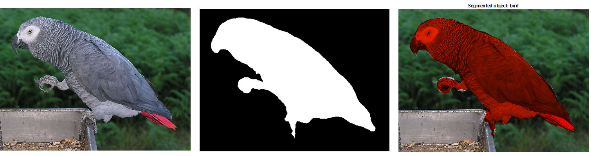

# A Simple Deep Learning Based Image Segmentation Tool

This is a simple tool that can be used for scemantic segmentations of coloured images. This tool adopts a pretrained deep learning model for segmentation. It needs both Python and Matlab installations. Also, some additional Python libraries are necessary.

This tool uses model is based on MobileNetV2 [1] architecture and is pretrained with Microsoft COCO dataset [2]. The model can segment and identify the objects: aeroplane, bicycle, bird, boat, bottle, bus, car, cat, chair, cow, dining table, dog, horse, motorbike, person, pottedplant, sheep, sofa, train, and tv.

## Getting Started
Download the Please read and follow the instructions in *User Manual.pdf* file.

## References
1. [MobileNetV2](https://github.com/tensorflow/models/tree/master/research/slim/nets/mobilenet)
2. [Microsoft COCO dataset](http://cocodataset.org/)
